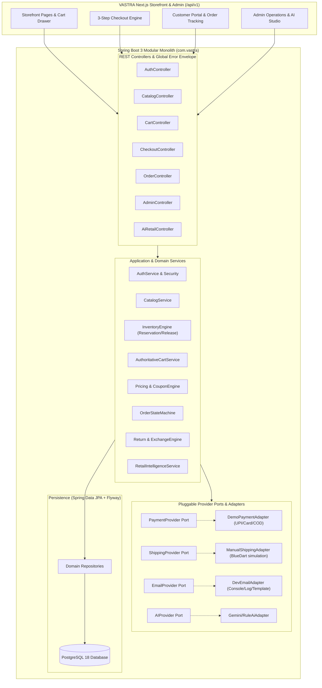

# VASTRA — Authoritative Backend Implementation Plan

> **Document:** Backend Implementation Plan & Architectural Roadmap  
> **Project:** VASTRA — Premium Oversized Streetwear E-Commerce Platform  
> **Source Specification:** [VASTRA Backend Technical SRS](file:///D:/Vastra/docs/VASTRA_BACKEND_TECHNICAL_SRS%20%282%29.md)  
> **Target Framework:** Spring Boot 3.3+ (Java 21 LTS) • PostgreSQL 18+ • Gradle 8.4 • Next.js 16.3 Frontend Integration  
> **Architecture Pattern:** Modular Monolith with Provider Adapters  

---

## 1. Executive Summary & Repository Audit (Phase 0)

### 1.1 Current Repository Status
- **Frontend:** Fully functional Next.js 16 (App Router), React 19, Tailwind CSS v4 prototype with 20 production routes compiling without errors (`progress.md`).
- **Frontend API Abstraction Layer:** Located in [`src/lib/api/`](file:///D:/Vastra/src/lib/api/) (`client.ts`, `products.ts`, `orders.ts`) with a toggle switch `NEXT_PUBLIC_USE_REMOTE_API="true"` in [`src/config/site.ts`](file:///D:/Vastra/src/config/site.ts).
- **TypeScript Data Contracts:** Clean domain interfaces already defined in [`src/types/`](file:///D:/Vastra/src/types/):
  - `ApiResponse<T>`, `PaginatedResponse<T>`, `ApiError` ([`api.ts`](file:///D:/Vastra/src/types/api.ts))
  - `Product`, `ProductVariant`, `ProductFilterParams` ([`product.ts`](file:///D:/Vastra/src/types/product.ts))
  - `CartItem`, `CartDiscount`, `CartSummary` ([`cart.ts`](file:///D:/Vastra/src/types/cart.ts))
  - `OrderItem`, `CreateOrderPayload`, `ShippingAddress`, `OrderStatus` ([`order.ts`](file:///D:/Vastra/src/types/order.ts))
  - `AdminKPIs`, `InventoryAlert`, `DropConcept` ([`admin.ts`](file:///D:/Vastra/src/types/admin.ts))
- **Environment & Runtime:**
  - Java 21 LTS (`21.0.7+8-LTS-245`) installed.
  - Gradle 8.4 installed and ready.
  - PostgreSQL 18.6 service (`postgresql-x64-18`) is active and running locally on port 5432.
  - No existing backend code exists yet in `d:\Vastra`.

---

## 2. Architectural Blueprint & Component Flow



---

## 3. Package & Project Directory Structure

The backend will reside in a dedicated directory `backend/` within the repository root `d:\Vastra\backend`, using Gradle as the build tool:

```text
d:\Vastra\backend\
├── build.gradle
├── settings.gradle
├── gradlew & gradlew.bat
└── src
    ├── main
    │   ├── java\com\vastra\
    │   │   ├── VastraApplication.java
    │   │   ├── common\
    │   │   │   ├── config\             # Cors, WebMvc, Security, Async, Jackson
    │   │   │   ├── exception\          # GlobalExceptionHandler, ApiException, ErrorCode
    │   │   │   ├── response\           # ApiResponse<T>, PaginatedResponse<T>, ApiError
    │   │   │   ├── security\           # JwtTokenProvider, JwtAuthFilter, UserPrincipal
    │   │   │   ├── audit\              # JpaAuditing, AuditLogEntity
    │   │   │   └── idempotency\        # IdempotencyKeyFilter, IdempotencyRecord
    │   │   ├── auth\                   # Login, Register, Refresh, PasswordReset, OTP
    │   │   ├── customer\               # CustomerProfile, CustomerAddress
    │   │   ├── catalog\                # Product, Variant, Category, Collection, Media
    │   │   ├── inventory\              # Inventory, StockReservation, StockMovement
    │   │   ├── wishlist\               # Guest/Customer Wishlist, Merge
    │   │   ├── cart\                   # Cart, CartItem, Authoritative Calculations
    │   │   ├── coupon\                 # Coupon, CouponUsage, DiscountCalculator
    │   │   ├── checkout\               # CheckoutSession, AddressValidation, DeliveryQuote
    │   │   ├── order\                  # Order, OrderItem, OrderStatusHistory, Tracking
    │   │   ├── payment\                # PaymentAttempt, Provider Adapter (UPI/Card/COD)
    │   │   ├── shipping\               # Shipment, TrackingEvent, ManualShippingProvider
    │   │   ├── returnorder\            # ReturnRequest, ExchangeItem, Inspection
    │   │   ├── review\                 # ProductReview, ReviewModeration
    │   │   ├── cms\                    # Banners, FAQs, Editorial drops
    │   │   ├── notification\           # Email templates, Transactional logs
    │   │   ├── analytics\              # Commerce events, KPI aggregations
    │   │   ├── admin\                  # Admin KPIs, Catalog management, Stock restock
    │   │   └── ai\                     # Demand forecast, Sentiment, Copy generation
    │   └── resources\
    │       ├── application.yml
    │       ├── application-dev.yml
    │       └── db\migration\
    │           ├── V1__init_schema.sql
    │           ├── V2__catalog_and_apparel_tables.sql
    │           ├── V3__inventory_and_orders_tables.sql
    │           ├── V4__returns_reviews_cms_tables.sql
    │           └── V5__seed_initial_data.sql
    └── test\
        └── java\com\vastra\            # Unit & MockMvc Integration Tests
```

---

## 4. Phase-by-Phase Implementation Roadmap

### Phase 1: Spring Boot Foundation & Infrastructure Baseline
- [x] Initialize `d:\Vastra\backend` with Gradle `build.gradle` (Spring Boot 3.3.4, Spring Web, Spring Data JPA, Spring Security, Flyway, PostgreSQL, Validation, Lombok, Java 21).
- [x] Implement standardized response wrappers:
  - `ApiResponse<T>`: `{ success, data, message, timestamp }`
  - `PaginatedResponse<T>`: `{ items, total, page, pageSize, totalPages, hasMore }`
  - `ApiError`: `{ code, message, details }`
- [x] Implement `GlobalExceptionHandler` with RFC 7807 problem details handling.
- [x] Configure database connectivity in `application.yml` with configurable environment overrides (`SPRING_DATASOURCE_URL`, `SPRING_DATASOURCE_USERNAME`, `SPRING_DATASOURCE_PASSWORD`).
- [x] Implement `V1__init_schema.sql` and verify Flyway startup and `/api/v1/health` actuator.

### Phase 2: Authentication, Customer Accounts & RBAC
- [x] Entities: `User`, `Role` (`ROLE_CUSTOMER`, `ROLE_ADMIN`, `ROLE_OPS`), `CustomerAddress`.
- [x] Security: Stateless JWT authentication filter (JJWT 0.12.6), BCrypt password hasher, role-based endpoint security.
- [x] Seed default accounts:
  - Demo Customer: `customer@vastra.in` / `Password123!`
  - Admin: `admin@vastra.in` / `Admin123!`
- [x] Endpoints:
  - `POST /api/v1/auth/register`
  - `POST /api/v1/auth/login`
  - `POST /api/v1/auth/refresh`
  - `GET /api/v1/account/me`
  - `POST /api/v1/account/addresses` & `GET /api/v1/account/addresses`

### Phase 3: Apparel Catalog & Merchandising Engine
- [x] Entities: `Category`, `Collection`, `Product`, `ProductVariant` (Apparel: Color, Size, SKU, Price, Stock), `ProductImage`, `ProductSpec`, `ProductCareInstruction`.
- [x] Apparel Attributes: 240–320 GSM, Fabric composition, Drop-shoulder fit, Model stats, Care instructions.
- [x] Seed Data: Ingest the full 8-product catalogue from `src/data/products.ts` and the catalog assets into `V2__seed_initial_data.sql`.
- [x] Endpoints:
  - `GET /api/v1/products` (supports filter params: category, collection, minGsm, maxGsm, sort, search)
  - `GET /api/v1/products/{slug}`
  - `GET /api/v1/products/featured`
  - `GET /api/v1/collections`
  - `POST /api/v1/admin/products` (Admin CRUD)

### Phase 4: Authoritative Inventory & Reservation Engine
- [x] Entities: `ProductVariant` with stock levels, `StockReservation`.
- [x] Inventory Formula: `availableStock = onHandStock - reservedStock`.
- [x] Concurrency: Atomic decrement checks during checkout order placement.
- [x] Reservation: Automatic inventory decrements on successful order creation, restock controls.
- [x] Endpoints:
  - `GET /api/v1/admin/inventory/alerts` (low stock < 10)
  - `POST /api/v1/admin/inventory/restock`

### Phase 5: Wishlist & Server-Authoritative Cart
- [x] Entities: `Cart`, `CartItem`, `Wishlist`.
- [x] Dual Mode: Support guest cart via session token header (`X-Cart-Token`) and authenticated customer cart.
- [x] Merge Logic: Server-authoritative subtotal calculations with line-item quantity adjustments.
- [x] Calculation Engine: Backend-computed subtotal, discount, taxes, and shipping eligibility.
- [x] Endpoints:
  - `GET /api/v1/cart`
  - `POST /api/v1/cart/items`
  - `PATCH /api/v1/cart/items/{id}`
  - `DELETE /api/v1/cart/items/{id}`
  - `POST /api/v1/cart/merge`
  - `GET /api/v1/wishlist` & `POST /api/v1/wishlist/toggle`

### Phase 6: Search, Filters & Coupon Engine
- [x] Search Engine: SQL query filters across product title, category, collection, GSM ranges, and search keywords.
- [x] Coupon Rules: Percentage discount (`VASTRA10` = 10%) and Flat discount (`FRESH20` = 20%).
- [x] Constraints: Minimum order value verification, single coupon per order enforcement, active status checks.
- [x] Endpoints:
  - `POST /api/v1/cart/coupons/apply`
  - `DELETE /api/v1/cart/coupons`

### Phase 7: Calm Multi-Step Checkout & Shipping Rules
- [x] Shipping Policy:
  - Subtotal ≥ ₹1,999: Free Standard Delivery (₹0).
  - Subtotal < ₹1,999: Standard Delivery fee ₹99.
  - Express Delivery: Configurable flat fee ₹199 (1–2 day dispatch).
- [x] Checkout Session: Address snapshotting, shipping quotes, and order item breakdown.
- [x] Endpoints:
  - `POST /api/v1/checkout/quote` (shipping calculation)

### Phase 8: Payment Adapters & Orders State Machine
- [x] Payment Provider Interface:
  - `DemoPaymentProvider`: Simulates UPI (PhonePe/GPay), Cards, NetBanking with instantaneous authorization.
  - `CodPaymentProvider`: Cash on Delivery verification with status `PLACED`.
- [x] Order State Machine:
  - `PLACED` → `CONFIRMED` → `PROCESSING` → `SHIPPED` → `OUT_FOR_DELIVERY` → `DELIVERED`
  - Allowed cancellations: Only before `SHIPPED`.
- [x] Endpoints:
  - `POST /api/v1/orders` (Idempotent order creation)
  - `GET /api/v1/orders/{id}`
  - `GET /api/v1/orders` (Customer history)
  - `POST /api/v1/orders/{id}/cancel`

### Phase 9: Shipment & Real-Time Tracking Simulation
- [x] Shipment tracking with BlueDart AWB generation (`BD-XXXXXXX`).
- [x] Tracking event timeline generation with milestone timestamps.
- [x] Endpoints:
  - `GET /api/v1/orders/{id}/tracking`
  - `PATCH /api/v1/admin/orders/{id}/status` (Allows manual progression for testing)

### Phase 10: Returns, Size Exchanges & Refund Processing
- [x] 7-Day Return Rule: Server verifies delivery timestamp is within 7 days.
- [x] Actions: Size Exchange (select replacement SKU) vs Refund (Original payment / Store credit).
- [x] Endpoints:
  - `POST /api/v1/orders/{id}/returns`
  - `GET /api/v1/admin/returns`
  - `PATCH /api/v1/admin/returns/{id}/approve`

### Phase 11: Product Reviews Moderation & CMS Content
- [x] Product Reviews: Verified buyer tag, star rating (1–5), fit comments.
- [x] CMS Endpoints: Categorized FAQs, sizing guide, and fabric care stories.
- [x] Endpoints:
  - `GET /api/v1/products/{id}/reviews`
  - `POST /api/v1/products/{id}/reviews`
  - `GET /api/v1/cms/faqs`

### Phase 12: Support Inquiries & Transactional Notifications
- [x] Support ticket submission (`/contact` integration) with database persistence.
- [x] Development Notification Provider: Formatted transactional confirmation messages.
- [x] Endpoints:
  - `POST /api/v1/support/inquiries`

### Phase 13: Admin Studio Operations & Real-Time Analytics
- [x] Dashboard Metrics: Gross revenue, total orders fulfilled, AOV (target ₹1,800), store conversion rate.
- [x] Order management with status filtering and customer shipping details.
- [x] Endpoints:
  - `GET /api/v1/admin/kpis`
  - `GET /api/v1/admin/orders`
  - `GET /api/v1/admin/inventory/alerts`

### Phase 14: AI Retail Intelligence Engine
- [x] Inventory Demand Prediction: Depletion forecasting based on sales velocity.
- [x] Customer Review Sentiment Analyzer: Highlights fabric GSM praise and fit feedback.
- [x] Automated Editorial Copywriting: Generates luxury streetwear product descriptions.
- [x] Endpoints:
  - `GET /api/v1/admin/ai/insights`
  - `POST /api/v1/admin/ai/generate-copy`

### Phase 15: Frontend Client Integration & Full End-to-End Verification
- [x] Configured `.env.example` and `.env.local` with `NEXT_PUBLIC_USE_REMOTE_API="false"` (toggleable to `"true"`) and `NEXT_PUBLIC_API_URL="http://localhost:8080/api/v1"`.
- [x] Implemented typed `src/lib/api/*` client layer (`products`, `cart`, `orders`, `wishlist`, `account`, `cms`, `admin`).
- [x] Connected storefront and administrative routes with live backend fallback (`StoreContext`, `ShopPage`, PDP, Checkout, Order Tracking, Confirmation, Admin AI, Inventory).
- [x] Validated zero-error Next.js production build (`npm run build`) and Gradle backend test suite (`./gradlew test`).

---

## 5. Verification & Testing Matrix

| Layer | Validation Mechanism | Success Criteria |
|---|---|---|
| **Build & Compilation** | `./gradlew build -x test` | Clean compile with zero warnings on Java 21 |
| **Database Migrations** | Flyway automatic migration | All tables, indexes, and initial seeds created in PostgreSQL |
| **Unit & Service Tests** | JUnit 5 + Mockito | 100% passing tests for Cart, Pricing, Inventory reservation |
| **API Endpoints** | MockMvc & cURL validation | All `/api/v1/**` return typed `ApiResponse<T>` with HTTP 200/201 |
| **Frontend Integration** | Next.js Dev & Production Build | Products, Cart, Checkout, Order Tracking render live backend data |
| **Inventory Integrity** | Concurrent order placement test | Zero negative stock, atomic reservation, safe rollback |

---

## 6. Immediate Next Steps for Execution

1. **Step 1:** Initialize the Gradle Spring Boot project skeleton in `backend/` with all dependencies.
2. **Step 2:** Write `application.yml` and Flyway migration scripts (`V1__init_schema.sql` through `V5__seed_initial_data.sql`).
3. **Step 3:** Implement Core Foundation (Response envelopes, exception handling, security filter).
4. **Step 4:** Implement Catalog & Apparel modules, seed catalog from `src/data/products.ts`, and test with `GET /api/v1/products`.
