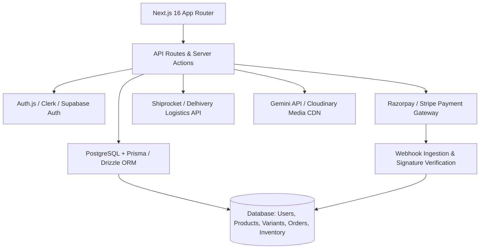

# 🛠️ VASTRA — Technical Depth & Production Readiness Roadmap

> **Document Scope:** Full architectural audit of remaining technical tasks, backend infrastructure, third-party integrations, security hardening, and production deployment considerations required to take the VASTRA prototype from interactive frontend to enterprise-grade production e-commerce.

---

## 🧭 Executive Architecture Roadmap

---

## 1. 🗄️ Database & Data Persistence Layer

### Current State:
- Data is statically loaded from `src/data/products.ts`.
- Cart, wishlist, and session state are managed in-memory via React Context (`StoreContext.tsx`) with volatile browser state.

### Technical Work Remaining:
1. **Choose & Configure ORM**: Install Prisma ORM or Drizzle ORM with PostgreSQL (Supabase or Neon serverless).
2. **Schema Definition**:
   - `User`: `id`, `name`, `email`, `phone`, `role` (CUSTOMER, ADMIN), `createdAt`.
   - `Address`: `id`, `userId`, `street`, `apartment`, `city`, `state`, `postalCode`, `isDefault`.
   - `Product`: `id`, `slug`, `title`, `description`, `price`, `compareAtPrice`, `gsm`, `fabricComposition`, `fit`, `collectionId`, `isPublished`.
   - `ProductVariant`: `id`, `productId`, `sku`, `size` (S, M, L, XL, XXL), `colorName`, `colorHex`, `inventoryQuantity`, `barcode`.
   - `ProductImage`: `id`, `productId`, `url`, `altText`, `displayOrder`, `isPrimary`.
   - `Order`: `id`, `orderNumber`, `userId`, `shippingAddressId`, `subtotal`, `shippingFee`, `discountAmount`, `totalAmount`, `status` (PENDING, PAID, PROCESSING, SHIPPED, DELIVERED, CANCELLED), `paymentMethod`, `paymentId`.
   - `OrderItem`: `id`, `orderId`, `variantId`, `quantity`, `unitPrice`.
3. **Database Migrations & Seed Scripts**: Create reproducible migration scripts to seed the initial catalog from `src/data/products.ts`.

---

## 2. 🔐 Authentication & Role-Based Access Control (RBAC)

### Current State:
- `/account` displays static mock customer information.
- `/admin/*` routes are publicly accessible without authentication guardrails.

### Technical Work Remaining:
1. **Auth Provider Integration**: Implement NextAuth.js (Auth.js v5) or Clerk:
   - Google & Apple OAuth 2.0 social login.
   - Phone OTP Login (via Twilio or MSG91) — critical for high-conversion Indian D2C checkout.
   - Magic link / Email OTP passwordless login.
2. **Middleware Route Protection**:
   - Configure `src/middleware.ts` to inspect session tokens.
   - Enforce customer-only access for `/account`, `/checkout`, `/order/*`.
   - Enforce `ADMIN` role claim for all `/admin/*` routes; redirect unauthorized users to `/admin/login`.
3. **Session Persistence**: Secure HTTP-only cookies with JWT verification and CSRF protection.

---

## 3. 💳 Payment Gateway Integration (Razorpay & Cashfree)

### Current State:
- Checkout simulates payments on button click and immediately forwards to the confirmation page.

### Technical Work Remaining:
1. **Razorpay Standard Checkout SDK**:
   - Server-side Order creation API (`/api/payments/razorpay/create-order`).
   - Client-side checkout modal opening with key ID, order ID, amount, and customer prefill.
2. **Webhook Verification**:
   - Secure webhook handler (`/api/webhooks/razorpay`).
   - HMAC SHA256 signature verification using Razorpay Webhook Secret.
   - Idempotent order state updates upon `payment.captured` or `payment.failed`.
3. **Alternative Payment Options**:
   - UPI Intent / QR code generation for direct mobile UPI apps (Google Pay, PhonePe, Paytm).
   - Cash on Delivery (COD) verification with automated OTP or phone confirmation to minimize Return-to-Origin (RTO) rates.

---

## 4. 🚚 Logistics, Shipping & Tracking (Shiprocket / Delhivery)

### Current State:
- Flat-rate shipping calculations and mock tracking timeline on `/order/[orderId]`.

### Technical Work Remaining:
1. **Pincode Serviceability API**:
   - Add a live pincode check widget on PDPs and checkout to calculate estimated delivery days and COD eligibility.
2. **AWB & Manifest Generation**:
   - Automated order push to Shiprocket/Delhivery API upon order payment.
   - Generate shipping labels, Air Waybill (AWB) numbers, and schedule courier pickups from the admin panel.
3. **Live Webhook Tracking**:
   - Receive courier status updates (`PICKED_UP`, `IN_TRANSIT`, `OUT_FOR_DELIVERY`, `DELIVERED`).
   - Reflect real-time live status on `/order/[orderId]` and trigger automated WhatsApp/SMS order notifications.

---

## 5. 🤖 AI Creative Studio Production Backend (Gemini API)

### Current State:
- `/admin/ai` has interactive UI inputs for prompts, moodboards, and drop ideation, but uses pre-rendered sample outputs.

### Technical Work Remaining:
1. **Gemini SDK Integration**:
   - Install `@google/genai` on the Next.js server.
   - Secure API key storage via `GEMINI_API_KEY` in `.env.local`.
2. **Server Actions for AI Generation**:
   - Create server action to stream generative marketing copy, fabric descriptions, and social media captions using `gemini-2.5-flash` or `gemini-2.5-pro`.
   - Image mockup generation: Integrate Imagen 3 API for automated drop concept visualization.
3. **Database Sync**:
   - Button to directly convert an AI-generated drop concept into a staged draft product in the PostgreSQL catalog.

---

## 6. ⚡ Performance, Caching & Media Optimization

### Current State:
- High-resolution editorial photography resides locally in `/public/images/` (~60 MB total).

### Technical Work Remaining:
1. **Cloud Media Storage & CDN**:
   - Offload images from local repository to Cloudinary or AWS S3 + CloudFront.
   - Enable automated WebP/AVIF format transcoding and on-the-fly resizing.
2. **Next.js Image Tag Optimization**:
   - Convert remaining standard `` tags to `next/image` with explicit `priority` flags for hero banners to optimize Largest Contentful Paint (LCP < 1.8s).
3. **Caching & ISR (Incremental Static Regeneration)**:
   - Configure `revalidate = 3600` on PDPs (`/product/[slug]`) and collection pages for lightning-fast edge delivery while maintaining fresh inventory.

---

## 7. 🔍 Search, Filtering & SEO Infrastructure

### Current State:
- Search modal and shop filters operate on client-side arrays.

### Technical Work Remaining:
1. **Search Backend**:
   - Upgrade search indexing to PostgreSQL Full-Text Search (Trigram / tsvector) or Meilisearch for typo tolerance and instant search-as-you-type.
2. **Dynamic Metadata & OpenGraph**:
   - Implement Next.js `generateMetadata` on `/product/[slug]` to produce dynamic titles, descriptions, and OpenGraph preview images (`/api/og`).
3. **Structured Data (JSON-LD)**:
   - Embed schema.org `Product`, `Offer`, `BreadcrumbList`, and `Organization` metadata for rich Google Shopping snippets.
4. **Sitemap & Robots**:
   - Generate automated `sitemap.ts` and `robots.ts` dynamically pulling active product slugs from the database.

---

## 8. 🛡️ Security, Error Handling & Observability

### Technical Work Remaining:
1. **Input Validation**: Use `zod` for all checkout inputs, shipping forms, and admin mutation APIs.
2. **Rate Limiting**: Protect checkout, contact, and OTP endpoints with Upstash Redis rate limiting.
3. **Global Error Boundaries**:
   - Implement `error.tsx`, `not-found.tsx`, and `global-error.tsx` App Router error boundaries with branded fallback interfaces.
4. **Monitoring & Logging**:
   - Connect Sentry for client/server error tracking and performance transaction traces.
   - Integrate PostHog or Google Analytics 4 for e-commerce event funnel analytics (View Item, Add to Cart, Begin Checkout, Purchase).

---

## 📋 Recommended Implementation Priority Matrix

| Phase | Focus Area | Key Deliverables | Estimated Effort |
|---|---|---|---|
| **Phase 1** | Data Layer & Persistence | PostgreSQL schema, Prisma/Drizzle ORM, Product APIs | 3–5 Days |
| **Phase 2** | Authentication & RBAC | NextAuth / Clerk, OTP phone login, Admin route guards | 2–3 Days |
| **Phase 3** | Payments & Checkout | Razorpay checkout, Webhook handler, Signature verification | 2–3 Days |
| **Phase 4** | Logistics & Operations | Shiprocket AWB API, Pincode validator, Real-time tracking | 3–4 Days |
| **Phase 5** | Production CDN & SEO | Cloudinary migration, Next/Image audit, Schema.org JSON-LD | 2 Days |
| **Phase 6** | Real Gemini AI Studio | `@google/genai` integration for drop generation & drafting | 2 Days |
